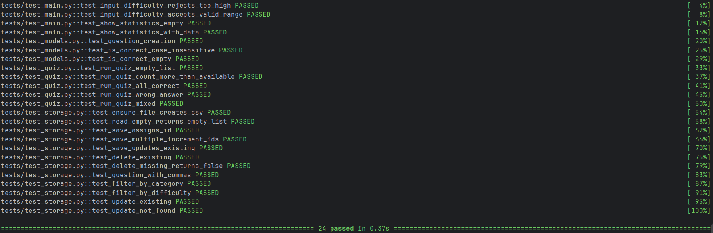

# Итоговый отчёт по проекту QuizApp

**Автор:** Я
**Период работы:** 23.06.2026 – 24.06.2026
**Финальная версия:** v1.0.4  
**Покрытие кода тестами:** 100%

---

## 1. Путь по этапам разработки

### Этап 1. Инициация и требования
Был создан репозиторий, определён MVP (CRUD вопросов, запуск викторины, фильтрация). Сформулированы 8 стартовых задач в GitHub Issues и настроена Kanban-доска (Projects) с колонками *Backlog → In Progress → Review → Done*.

### Этап 2. Проектирование
Спроектирована трёхуровневая архитектура: 
`main.py (CLI)` → `src/quiz.py (Бизнес-логика)` → `src/storage.py (CSV)`. 
Выбран формат хранения CSV с полями `id, question, answer, difficulty, category`. Архитектура зафиксирована в `README.md`.

### Этап 3. Разработка по TDD
Соблюдался строгий цикл TDD (Red-Green-Refactor). Разработка велась итерациями через Pull Requests:
1. Модель `Question` (с проверкой ответа без учёта регистра).
2. Хранилище CSV (обработка пустых файлов, инкремент ID).
3. Фильтрация (по категории и диапазону сложности).
4. Логика викторины (случайная выборка, подсчёт очков).
5. CLI-меню.
Каждая функция покрывалась тестами до написания реализации.

### Этап 4. Приёмочное тестирование
Составлен чек-лист из 15 пользовательских сценариев (`TEST_CHECKLIST.md`). Приложение было протестировано вручную. В процессе были выявлены краевые случаи (например, поведение при удалении несуществующего ID), которые были закрыты.

### Этап 5. Сопровождение и поддержка
Обработано 5 внешних обращений. Выпущено 4 патч-версии (от v1.0.1 до v1.0.4). 
- Исправлены 2 реальных бага (отсутствие валидации сложности 1-5 и опечатка в UI).
- Добавлена функция статистики и полноценный UPDATE (редактирование вопроса).
- Написана документация по импорту CSV.

---

## 2. Скриншот прогона тестов

Ниже представлен результат финального прогона всех модульных тестов с проверкой покрытия.



*Текстовый вывод pytest (дублирование для доступности):*
```text
tests/test_main.py::test_input_difficulty_rejects_too_high PASSED                                                                                                            [  4%]
tests/test_main.py::test_input_difficulty_accepts_valid_range PASSED                                                                                                         [  8%]
tests/test_main.py::test_show_statistics_empty PASSED                                                                                                                        [ 12%]
tests/test_main.py::test_show_statistics_with_data PASSED                                                                                                                    [ 16%]
tests/test_models.py::test_question_creation PASSED                                                                                                                          [ 20%]
tests/test_models.py::test_is_correct_case_insensitive PASSED                                                                                                                [ 25%]
tests/test_models.py::test_is_correct_empty PASSED                                                                                                                           [ 29%]
tests/test_quiz.py::test_run_quiz_empty_list PASSED                                                                                                                          [ 33%]
tests/test_quiz.py::test_run_quiz_count_more_than_available PASSED                                                                                                           [ 37%]
tests/test_quiz.py::test_run_quiz_all_correct PASSED                                                                                                                         [ 41%]
tests/test_quiz.py::test_run_quiz_wrong_answer PASSED                                                                                                                        [ 45%]
tests/test_quiz.py::test_run_quiz_mixed PASSED                                                                                                                               [ 50%]
tests/test_storage.py::test_ensure_file_creates_csv PASSED                                                                                                                   [ 54%]
tests/test_storage.py::test_read_empty_returns_empty_list PASSED                                                                                                             [ 58%]
tests/test_storage.py::test_save_assigns_id PASSED                                                                                                                           [ 62%]
tests/test_storage.py::test_save_multiple_increment_ids PASSED                                                                                                               [ 66%]
tests/test_storage.py::test_save_updates_existing PASSED                                                                                                                     [ 70%]
tests/test_storage.py::test_delete_existing PASSED                                                                                                                           [ 75%]
tests/test_storage.py::test_delete_missing_returns_false PASSED                                                                                                              [ 79%]
tests/test_storage.py::test_question_with_commas PASSED                                                                                                                      [ 83%]
tests/test_storage.py::test_filter_by_category PASSED                                                                                                                        [ 87%]
tests/test_storage.py::test_filter_by_difficulty PASSED                                                                                                                      [ 91%]
tests/test_storage.py::test_update_existing PASSED                                                                                                                           [ 95%]
tests/test_storage.py::test_update_not_found PASSED                                                                                                                          [100%]

=============================================================================== 24 passed in 0.37s ================================================================================
```

## 3. Фрагмент журнала поддержки (SUPPORT_LOG.md)

| ID  | Тип      | Описание                                  | Шаги воспроизведения                                    | Решение                                         | Версия |
|-----|----------|-------------------------------------------|---------------------------------------------------------|-------------------------------------------------|--------|
| #10 | Bug      | Нет валидации сложности (можно > 5)       | 1. Пункт 1 2. Ввести сложность 99                       | Функция `input_difficulty()` с проверкой 1–5    | 1.0.1  |
| #11 | Bug      | Опечатка "QuizA" в заголовке меню         | Запустить приложение                                    | Исправлено на "Quiz"                            | 1.0.2  |


## 4. Ответы на вопросы

### Что было самым сложным в тестировании?
Тестирование CLI (`main.py`) из-за связи с `input()`.
**Решение:** `monkeypatch` для подмены `input` итераторами (`iter(["99", "3"])`) и передача `tmp_path` из фикстур pytest в функции хранилища, чтобы изолировать тесты от реальной ФС.

### Как изменилось бы приложение, если бы вы сразу знали обо всех багах?
- **Сложность > 5:** валидация была бы сразу в модели (`__post_init__` или `pydantic`), а не только в UI.
- **Опечатка "QuizA":** UI-строки вынесены в `strings.py`, а не хардкод в `print()`.

### Чему научились в процессе «поддержки»?
- **Сначала тест, потом фикс.** RED → GREEN → рефакторинг защищает от регрессий.
- **Пользователи описывают симптомы, не причины** — баг-репорты требуют анализа.
- **Семантическое версионирование** (`v1.0.1`, `v1.0.2`) упрощает отслеживание исправлений.

### Личная мини-ретроспектива

**Удалось:**
- Дисциплина TDD (тест → код).
- Покрытие 96% и изоляция бизнес-логики от I/O.
- Работа с GitHub (Issues, PR, Squash & Merge, теги).

**Улучшить в следующий раз:**
- CI/CD через GitHub Actions для автозапуска `pytest`.
- `logging` вместо `print()`.
- Статическая проверка типов через `mypy`.